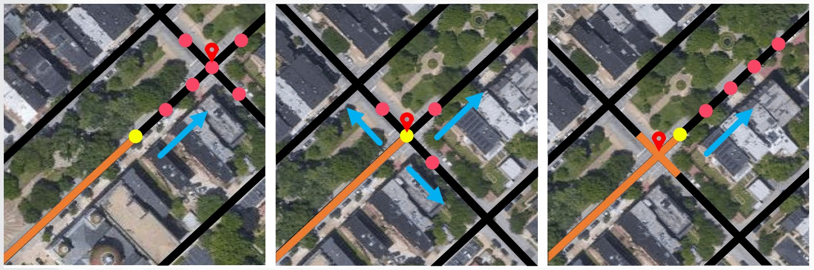

# VecRoad

The official repo of the CVPR 2020 paper "VecRoad: Point-based Iterative Graph Exploration for Road Graphs Extraction"

\[[paper](http://openaccess.thecvf.com/content_CVPR_2020/papers/Tan_VecRoad_Point-Based_Iterative_Graph_Exploration_for_Road_Graphs_Extraction_CVPR_2020_paper.pdf)\] \[[homepage](https://mmcheng.net/vecroad)\]



## Prepare Data

### Datasets

OSM Dataset [Baidu Netdisk](https://pan.baidu.com/s/1OKG6R1CwAESbHTPXTZdH5w) with code: f97v

### Pretrained models

RP-Net [Baidu NetDisk](https://pan.baidu.com/s/15Qloov4cuJCQPDSYcv9G8w)
with code: 9nk4

### Evaluation matrics

apls-visualizer-1.0 [Baidu Netdisk](https://pan.baidu.com/s/1xm_FDxJE81KEGbTW8-suJQ) with code: ugbz | [Google Drive](https://drive.google.com/file/d/1rwbj_o-ELBfruPZuVkCnEQxAX2-Pz5DX/view?usp=sharing)

### Steps

1. Download [OSM Dataset](https://pan.baidu.com/s/1OKG6R1CwAESbHTPXTZdH5w), [RP-Net](https://pan.baidu.com/s/15Qloov4cuJCQPDSYcv9G8w) and [APLS](https://pan.baidu.com/s/1xm_FDxJE81KEGbTW8-suJQ) into `data/downloads`.
2. `sh prepare_data.sh`

## Requirements

conda could install the right version of `rtree`.

``` requirements
pytorch>=0.4.1
rtree==0.8.3
numpy==1.16.3
pillow==6.0.0
opencv-python==4.1.0.25
networkx==2.3
shapely==1.6.4
pickle==0.7.5
scikit-image==0.15.0
pyyaml==5.1
```

## Inference

``` python
python infer.py --config configs/default.yml
```

## Evaluation

Junction Metric (Golang needed). Please refer to [roadtracer](https://github.com/mitroadmaps/roadtracer) for more details.

``` python
python eval/eval_junction_metric.py \
    --graph_dir data/graphs/vecroad_4/graphs_junc/ \
    --gt_dir data/input/graphs/ \
    --save_dir data/graphs/vecroad_4/ \
    --file_name graphs_junc_jf1.csv
```

APLS Metric (Java needed). Please refer to [Spacenet Challenge](https://github.com/SpaceNetChallenge) for more details.

``` python
python eval/graphs2wkt.py \
    --graph_dir data/graphs/vecroad_4/graphs_junc/ \
    --save_dir data/graphs/vecroad_4/graphs_junc_wkt/

python eval/eval_apls_metric.py \
    --apls_path eval/apls-visualizer-1.0/visualizer.jar \
    --wkt_dir data/graphs/vecroad_4/graphs_junc_wkt/ \
    --gt_dir data/input/graphs_test_wkt/ \
    --save_dir data/graphs/vecroad_4/ \
    --file_name graphs_junc_apls.csv
```

Pixel Metric (C++ needed). Please refer to [ssai-cnn](https://github.com/mitmul/ssai-cnn) for more details.

``` python
python eval/graphs2seg.py \
    --graph_dir data/graphs/vecroad_4/graphs_junc/ \
    --save_dir data/graphs/vecroad_4/graphs_junc_seg/ \
    --region_file data/input/regions/test_regions.txt \
    --img_size 8192 \
    --thickness 8
```


## Citation

If you find this work or code is helpful in your research, please cite:
```
@inproceedings{VecRoad_20CVPR,
 title={VecRoad: Point-based Iterative Graph Exploration for Road Graphs Extraction},
 author={Yong-Qiang Tan and Shanghua Gao and Xuan-Yi Li and Ming-Ming Cheng and Bo Ren},
 booktitle={IEEE CVPR},
 year={2020},
}
```

## License

Our source code is free for non-commercial usage.
Please contact us if you want to use it for comercial usage.
(yoqitan -AT- outlook -DOT- com)

## Training Scripts

Due to certain restrictions, the training script cannot be released at this time.
